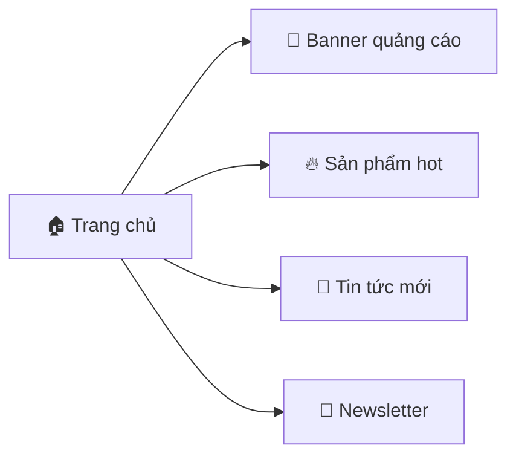
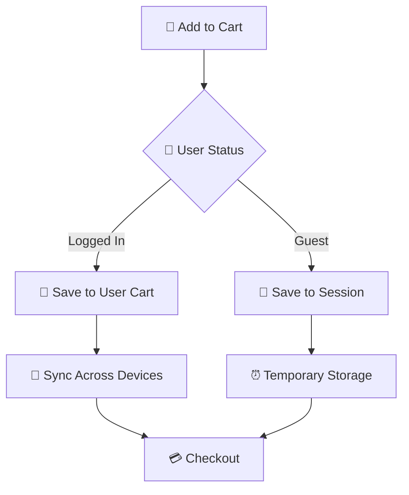
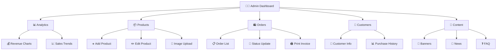
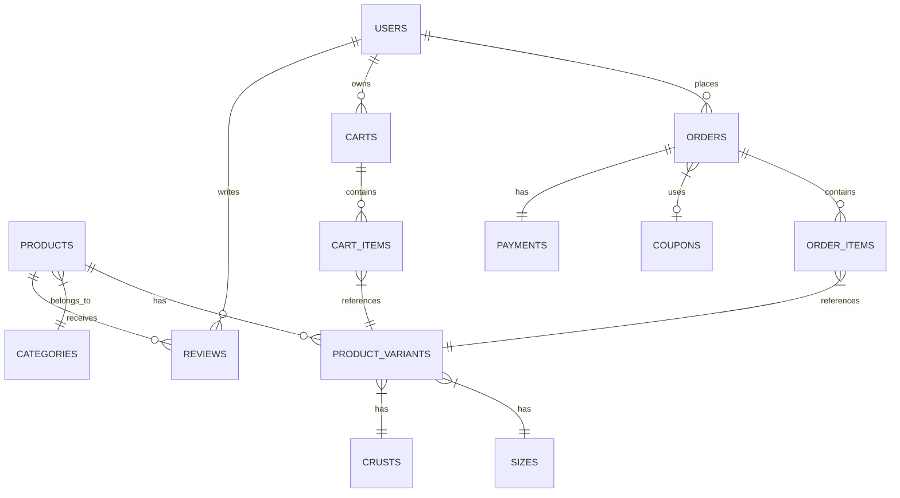

# 🍕 Pizza Shop - Website Bán Pizza Online

<div align="center">


[](https://github.com/pizzashop/releases)
[](LICENSE)
[](https://github.com/pizzashop/actions)
[](https://github.com/pizzashop/contributors)

**🚀 Website bán pizza trực tuyến hiện đại với đầy đủ chức năng quản lý và thanh toán**

[🌟 Demo Live](https://demo.pizzashop.com) • [📖 Documentation](https://docs.pizzashop.com) • [🐛 Report Bug](https://github.com/pizzashop/issues) • [💡 Request Feature](https://github.com/pizzashop/issues)

</div>

---

## 📋 Table of Contents

- [🌟 Giới thiệu](#-giới-thiệu)
- [✨ Tính năng nổi bật](#-tính-năng-nổi-bật)
- [🚀 Chức năng chính](#-chức-năng-chính)
- [🏗️ Cấu trúc Database](#️-cấu-trúc-database)
- [💻 Công nghệ sử dụng](#-công-nghệ-sử-dụng)
- [⚡ Quick Start](#-quick-start)
- [🔧 API Reference](#-api-reference)
- [🔒 Bảo mật](#-bảo mật)
- [🎯 Roadmap](#-roadmap)
- [🤝 Contributing](#-contributing)

---

## 🌟 Giới thiệu

> **Pizza Shop** là một website thương mại điện tử chuyên về pizza, được thiết kế với trải nghiệm người dùng tối ưu và hệ thống quản lý mạnh mẽ.

### 🎯 Mục tiêu
- 🍕 Mang đến trải nghiệm đặt pizza online tuyệt vời
- 📱 Responsive design cho mọi thiết bị
- ⚡ Performance cao và tải trang nhanh
- 🔐 Bảo mật thông tin khách hàng tuyệt đối

---

## ✨ Tính năng nổi bật

<table>
<tr>
<td width="50%">

### 🛍️ **Cho Khách Hàng**
- 🏠 **Trang chủ hiện đại** với banner động
- 🍕 **Pizza customization** (size + đế)
- 🛒 **Smart cart** lưu trạng thái
- 💳 **Thanh toán đa dạng** (COD, Card, PayPal...)
- ⭐ **Review system** 5 sao
- 🎟️ **Mã giảm giá** thông minh
- 📱 **Mobile-first design**

</td>
<td width="50%">

### 👨‍💼 **Cho Admin**
- 📊 **Dashboard** với charts realtime
- 📦 **Quản lý sản phẩm** advanced
- 🚚 **Order tracking** workflow
- 👥 **Customer management**
- 🎨 **Content management** (banners, news)
- 📈 **Analytics & Reports**
- 🔧 **System settings**

</td>
</tr>
</table>

---

## 🚀 Chức năng chính

### 🏠 **1. Trang chủ (Home Page)**


<details>
<summary>📋 Chi tiết chức năng</summary>

- **🎨 Hero Banner**: Slider với các promotion hot
- **🔥 Featured Products**: Top pizza bestseller
- **📰 Latest News**: Tin tức, khuyến mãi mới
- **⭐ Customer Reviews**: Đánh giá từ khách hàng
- **📍 Store Locator**: Bản đồ cửa hàng

</details>

---

### 🍕 **2. Quản lý sản phẩm**

<div align="center">

| 🏷️ **Danh mục** | 📝 **Mô tả** | 🎯 **Đặc điểm** |
|:---:|:---:|:---:|
| 🦐 Pizza Hải Sản | Tôm, cua, mực tươi | Premium ingredients |
| 🥬 Pizza Chay | 100% thuần chay | Healthy choice |
| 🥩 Pizza Thịt | Pepperoni, xúc xích | Classic flavors |
| 🧀 Pizza Phô Mai | 4 loại phô mai | Cheese lovers |
| 🍕 Pizza Truyền Thống | Công thức cổ điển | Authentic taste |
| ⭐ Pizza Đặc Biệt | Sáng tạo độc quyền | Chef's special |
| 🥤 Nước Uống | Giải khát đa dạng | Fresh drinks |
| 🍰 Tráng Miệng | Bánh ngọt, kem | Sweet endings |

</div>

**🎛️ Tùy chọn Pizza:**

```yaml
Sizes:
  - 🔸 Mini (12cm): Perfect for kids
  - 🔹 Nhỏ (20cm): Individual serving  
  - 🔶 Vừa (25cm): For 2-3 people
  - 🔷 Lớn (30cm): Family size
  - 🟠 Siêu Lớn (40cm): Party size

Crusts:
  - 🥖 Đế Mỏng: Crispy & light
  - 🍞 Đế Dày: Soft & fluffy  
  - 🧀 Viền Phô Mai: Cheese-stuffed crust
  - 🌭 Đế Nhân Nhồi: Sausage-filled
  - 🌿 Đế Thảo Mộc: Herbed crust
```

---

### 🛒 **3. Giỏ hàng thông minh**



**✨ Features:**
- 🔄 **Auto-sync** cho user đăng nhập
- 💾 **Persistent storage** với database
- 🍪 **Session storage** cho guest
- ⚡ **Real-time updates** khi thay đổi
- 🧮 **Auto-calculate** tổng tiền, thuế, phí ship

---

### 💳 **4. Hệ thống thanh toán**

<div align="center">

| 💳 **Phương thức** | 🏷️ **Phí** | ⏱️ **Xử lý** | 🔒 **Bảo mật** |
|:---:|:---:|:---:|:---:|
| 💵 COD | Miễn phí | Tức thì | ⭐⭐⭐ |
| 💳 Credit Card | 2.9% | 1-3 phút | ⭐⭐⭐⭐⭐ |
| 🏦 Bank Transfer | Miễn phí | 15-30 phút | ⭐⭐⭐⭐ |
| 💙 PayPal | 3.4% | Tức thì | ⭐⭐⭐⭐⭐ |

</div>

---

### 👤 **5. Quản lý tài khoản**

```yaml
Authentication:
  📝 Register: Email verification required
  🔐 Login: Username/Email + Password
  🔑 Password Reset: OTP via email/SMS
  👤 Profile Management: Update info anytime

User Dashboard:
  📊 Overview: Order stats, points earned
  📦 Order History: Track all purchases  
  ⭐ Reviews: Rate & comment products
  🎟️ Coupons: Available vouchers
  📍 Addresses: Multiple delivery locations
  🔔 Notifications: Order updates, promotions
```

---

### 🔧 **6. Admin Panel**

<div align="center">



</div>

**🎯 Key Features:**
- 📈 **Real-time Dashboard** với charts động
- 🔄 **Bulk Operations** cho products/orders
- 📱 **Mobile Admin** responsive design
- 🔔 **Push Notifications** cho orders mới
- 📊 **Advanced Analytics** với filters
- 🎨 **WYSIWYG Editor** cho content

---

### 🎟️ **7. Hệ thống khuyến mãi**

<table>
<tr>
<td width="33%">

#### 💯 **Percentage Discount**
```yaml
Examples:
  PIZZA10: 10% off
  SUMMER20: 20% off  
  FLASH25: 25% off
  VIP15: 15% off

Conditions:
  Min Order: 200k+
  Valid Until: Set expiry
  Usage Limit: Per user/total
```

</td>
<td width="33%">

#### 💰 **Fixed Amount**
```yaml
Examples:
  FREESHIP: -30k shipping
  NEWUSER: -50k first order
  COMBO50: -50k combo deals
  PIZZADAY: -20k special day

Benefits:
  Easy to understand
  Great for small orders
  Shipping incentives
```

</td>
<td width="34%">

#### 🎁 **Special Offers**
```yaml
Examples:
  BUY2GET1: Free pizza
  LOYALTY: Points system
  BIRTHDAY: Special discount
  WEEKEND: Weekend deals

Features:
  Auto-apply eligible
  Stack with points
  Member exclusive
```

</td>
</tr>
</table>

---

## 🏗️ Cấu trúc Database

### 📊 **Database Schema Overview**



### 🗃️ **Core Tables**

<details>
<summary>👥 <strong>Users & Authentication</strong></summary>

```sql
-- 👤 Users: Customer & Admin accounts
users (id, username, password, email, full_name, address, phone, role, timestamps)

-- 📞 Contacts: Customer inquiries  
contacts (id, user_id, name, email, message, created_at)
```
</details>

<details>
<summary>🍕 <strong>Products & Catalog</strong></summary>

```sql
-- 🏷️ Categories: Product classification
categories (id, name, description, created_at)

-- 🍕 Products: Pizza and items
products (id, name, description, image_url, category_id, timestamps)

-- 📏 Sizes: Pizza dimensions  
sizes (id, name, diameter, created_at)

-- 🥖 Crusts: Pizza base types
crusts (id, name, description, created_at)

-- 🎛️ Product Variants: Size + Crust + Price combinations
product_variants (id, product_id, size_id, crust_id, price, stock, timestamps)
```
</details>

<details>
<summary>🛒 <strong>Shopping & Orders</strong></summary>

```sql
-- 🛒 Carts: Shopping baskets
carts (id, user_id, session_id, created_at)

-- 📦 Cart Items: Products in cart
cart_items (id, cart_id, product_variant_id, quantity)

-- 🛍️ Orders: Purchase records
orders (id, user_id, total_amount, status, shipping_address, coupon_id, created_at)

-- 📋 Order Items: Products in order
order_items (id, order_id, product_variant_id, quantity, price)

-- 💳 Payments: Transaction records
payments (id, order_id, amount, method, status, transaction_id, created_at)
```
</details>

<details>
<summary>🎯 <strong>Marketing & Content</strong></summary>

```sql
-- 🎟️ Coupons: Discount codes
coupons (id, code, discount_percentage, discount_amount, expiry_date, min_order_amount, created_at)

-- ⭐ Reviews: Product ratings
reviews (id, product_id, user_id, rating, comment, created_at)

-- 🎨 Banners: Promotional images
banners (id, image_url, link, position, active, created_at)

-- 📰 News: Company updates
news (id, title, content, image_url, created_at)

-- ❓ FAQ: Frequently asked questions
faq (id, question, answer, created_at)
```
</details>

### 📈 **Sample Data Overview**

<div align="center">

| 📊 **Table** | 🔢 **Records** | 📝 **Description** |
|:---:|:---:|:---|
| 👥 Users | 10 | 8 customers + 2 admins |
| 🏷️ Categories | 10 | Pizza types, drinks, desserts |
| 🍕 Products | 10 | Various pizzas and items |
| 📏 Sizes | 10 | From mini to family size |
| 🥖 Crusts | 10 | Thin, thick, stuffed crusts |
| 🎟️ Coupons | 10 | Percentage & fixed discounts |
| 🛍️ Orders | 10 | Different statuses & customers |
| ⭐ Reviews | 10 | 1-5 star ratings with comments |
| 🎨 Banners | 10 | Homepage & product page ads |
| 📰 News | 10 | Promotions & updates |

</div>

---

## 💻 Công nghệ sử dụng

### 🏗️ **Tech Stack**

<div align="center">


</div>

### Backend Options

<table>
<tr>
<td width="33%">

#### 🐘 **PHP Stack**
```yaml
Core: PHP 8.1+
Framework: Laravel/CodeIgniter
Database: MySQL 8.0+
Server: Apache/Nginx
Cache: Redis
```

</td>
<td width="33%">

#### 🟢 **Node.js Stack**  
```yaml
Runtime: Node.js 18+
Framework: Express.js
Database: MySQL + Sequelize
Auth: JWT/Passport
Cache: Redis
```

</td>
<td width="34%">

#### 🐍 **Python Stack**
```yaml
Language: Python 3.9+
Framework: Django/FastAPI  
Database: MySQL + SQLAlchemy
Auth: Django Auth/OAuth2
Cache: Redis
```

</td>
</tr>
</table>

### Frontend Technologies

```yaml
🎨 Core:
  - HTML5 semantic markup
  - CSS3 with Flexbox/Grid
  - Vanilla JavaScript ES6+
  - Responsive design principles

📱 Frameworks (Optional):
  - React.js with hooks
  - Vue.js 3 composition API
  - Bootstrap 5 / Tailwind CSS
  - SCSS for advanced styling

⚡ Performance:
  - Lazy loading images
  - Code splitting
  - Service workers
  - CDN integration
```

---

## ⚡ Quick Start

### 🚀 **Installation**

<details>
<summary>🐳 <strong>Docker Setup (Recommended)</strong></summary>

```bash
# Clone repository
git clone https://github.com/yourusername/pizza-shop.git
cd pizza-shop

# Start with Docker Compose
docker-compose up -d

# Import database
docker exec -i pizza_shop_db mysql -u root -ppassword pizza_shop < database/pizza_shop.sql

# Access application
open http://localhost:8080
```

</details>

<details>
<summary>💻 <strong>Manual Setup</strong></summary>

```bash
# 1️⃣ Clone & Setup
git clone https://github.com/yourusername/pizza-shop.git
cd pizza-shop

# 2️⃣ Database Setup
mysql -u root -p
CREATE DATABASE pizza_shop;
mysql -u root -p pizza_shop < database/pizza_shop.sql

# 3️⃣ PHP Setup
composer install
cp .env.example .env
php artisan key:generate
php artisan serve

# 4️⃣ Node.js Setup (Alternative)
npm install
cp .env.example .env
npm run dev
```

</details>

### ⚙️ **Configuration**

```yaml
# .env file
APP_NAME=Pizza Shop
APP_URL=http://localhost:8000
APP_DEBUG=true

DB_CONNECTION=mysql
DB_HOST=127.0.0.1
DB_PORT=3306
DB_DATABASE=pizza_shop
DB_USERNAME=your_username
DB_PASSWORD=your_password

MAIL_MAILER=smtp
MAIL_HOST=smtp.gmail.com
MAIL_PORT=587
MAIL_USERNAME=your_email@gmail.com
MAIL_PASSWORD=your_app_password

PAYMENT_STRIPE_KEY=sk_test_...
PAYMENT_PAYPAL_CLIENT_ID=your_paypal_id
```

---

## 🔧 API Reference

### 🔐 **Authentication Endpoints**

```http
POST   /api/auth/register          # 📝 User registration
POST   /api/auth/login             # 🔐 User login  
POST   /api/auth/logout            # 🚪 User logout
POST   /api/auth/refresh           # 🔄 Refresh token
POST   /api/auth/forgot-password   # 🔑 Password reset
```

### 🍕 **Product Endpoints**

```http
GET    /api/products               # 📋 List all products
GET    /api/products/{id}          # 🔍 Get product details
GET    /api/products/search        # 🔎 Search products
GET    /api/categories             # 🏷️ List categories
GET    /api/products/featured      # ⭐ Featured products
```

### 🛒 **Cart & Order Endpoints**

```http
GET    /api/cart                   # 👀 View cart
POST   /api/cart/add               # ➕ Add to cart
PUT    /api/cart/update/{id}       # ✏️ Update cart item
DELETE /api/cart/remove/{id}       # 🗑️ Remove from cart
POST   /api/cart/clear             # 🧹 Clear cart

POST   /api/orders                 # 🛍️ Create order
GET    /api/orders                 # 📋 List user orders
GET    /api/orders/{id}            # 🔍 Order details
PUT    /api/orders/{id}/cancel     # ❌ Cancel order
```

### 👑 **Admin Endpoints**

```http
GET    /api/admin/dashboard        # 📊 Admin dashboard
GET    /api/admin/orders           # 📦 Manage orders
PUT    /api/admin/orders/{id}      # ✏️ Update order status
GET    /api/admin/customers        # 👥 Customer list
POST   /api/admin/products         # ➕ Add product
PUT    /api/admin/products/{id}    # ✏️ Update product
DELETE /api/admin/products/{id}    # 🗑️ Delete product
```

### 📊 **Response Format**

```json
{
  "success": true,
  "message": "Operation successful",
  "data": {
    "id": 1,
    "name": "Pizza Margherita",
    "price": 150000,
    "variants": [...]
  },
  "meta": {
    "pagination": {
      "current_page": 1,
      "total_pages": 5,
      "per_page": 20,
      "total_items": 100
    }
  }
}
```

---

## 🔒 Bảo mật

### 🛡️ **Security Measures**

<table>
<tr>
<td width="50%">

#### 🔐 **Authentication & Authorization**
- ✅ **Password Hashing**: bcrypt/argon2
- ✅ **JWT Tokens**: Secure & stateless
- ✅ **Role-based Access**: Admin vs Customer
- ✅ **Session Management**: Secure sessions
- ✅ **2FA Support**: Optional two-factor auth

</td>
<td width="50%">

#### 🛡️ **Data Protection**  
- ✅ **SQL Injection**: Prepared statements
- ✅ **XSS Protection**: Input sanitization
- ✅ **CSRF Protection**: CSRF tokens
- ✅ **HTTPS Enforcement**: SSL/TLS required
- ✅ **Data Encryption**: Sensitive data encrypted

</td>
</tr>
</table>

### 🔍 **Security Checklist**

- [x] 🔒 **HTTPS Only** - All communications encrypted
- [x] 🛡️ **Input Validation** - All user inputs validated
- [x] 🔐 **Secure Headers** - Security headers implemented  
- [x] 🚫 **Rate Limiting** - Prevent abuse & DDoS
- [x] 📝 **Audit Logs** - Track all admin actions
- [x] 🔄 **Regular Updates** - Dependencies kept current
- [x] 🧪 **Security Testing** - Regular penetration testing
- [x] 💾 **Backup Strategy** - Regular encrypted backups

---

## 🎯 Roadmap

### 🚀 **Version 1.1 (Next Release)**
- [ ] 📱 **Mobile App** (React Native)
- [ ] 🔔 **Push Notifications** 
- [ ] 🗺️ **Real-time Delivery Tracking**
- [ ] 💬 **Live Chat Support**
- [ ] 🎁 **Loyalty Points System**

### 🌟 **Version 1.2 (Future)**
- [ ] 🤖 **AI Recommendations**
- [ ] 🎨 **Pizza Builder Tool** 
- [ ] 📊 **Advanced Analytics**
- [ ] 🌐 **Multi-language Support**
- [ ] 💰 **Cryptocurrency Payments**

### 🔮 **Version 2.0 (Long-term)**
- [ ] 🏪 **Multi-store Management**
- [ ] 🤝 **Franchise System**
- [ ] 📱 **POS Integration**
- [ ] 🚁 **Drone Delivery**
- [ ] 🌍 **International Expansion**

---

## 🤝 Contributing

### 💝 **How to Contribute**

<div align="center">

[](CONTRIBUTING.md)
[](https://github.com/pizzashop/issues)
[](https://github.com/pizzashop/issues)

</div>

1. 🍴 **Fork** the repository
2. 🌿 **Create** your feature branch (`git checkout -b feature/AmazingFeature`)
3. 💾 **Commit** your changes (`git commit -m 'Add some AmazingFeature'`)
4. 📤 **Push** to the branch (`git push origin feature/AmazingFeature`)
5. 🔀 **Open** a Pull Request

### 👥 **Contributors**

<div align="center">

<a href="https://github.com/pizzashop/contributors">
  
</a>

**Made with ❤️ by our amazing contributors**

</div>

---

## 📞 Support & Contact

<div align="center">

### 🆘 **Need Help?**

[](mailto:support@pizzashop.com)
[](https://discord.gg/pizzashop)
[](https://docs.pizzashop.com)

### 📱 **Hotline**: 1900-PIZZA (24/7)

</div>

---

<div align="center">

## 🏆 **Pizza Shop - Delivering Happiness, One Slice at a Time!**

[](https://github.com/pizzashop/pizzashop/stargazers)
[](https://github.com/pizzashop/pizzashop/network)
[](https://github.com/pizzashop/pizzashop/watchers)

**⭐ Nếu project này hữu ích, đừng quên give us a star! ⭐**

---

*Made with 🍕 and ❤️ by Pizza Shop Team*

**© 2025 Pizza Shop. All rights reserved.**

</div>