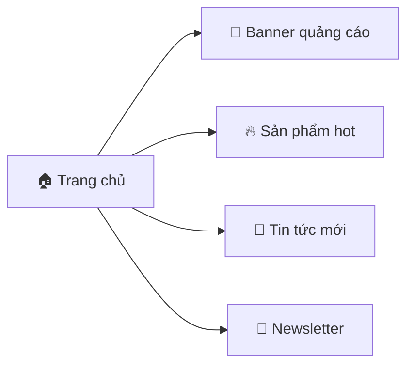
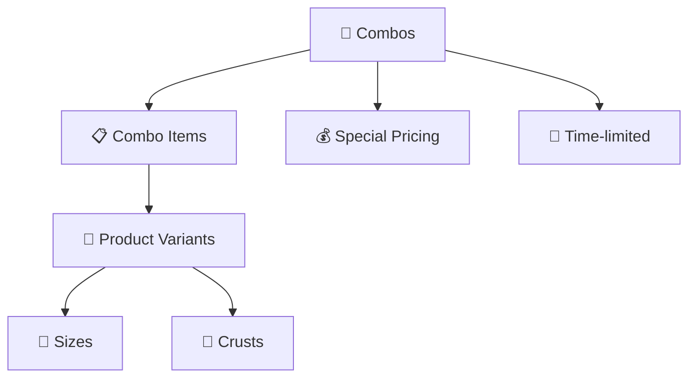
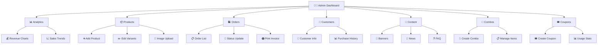
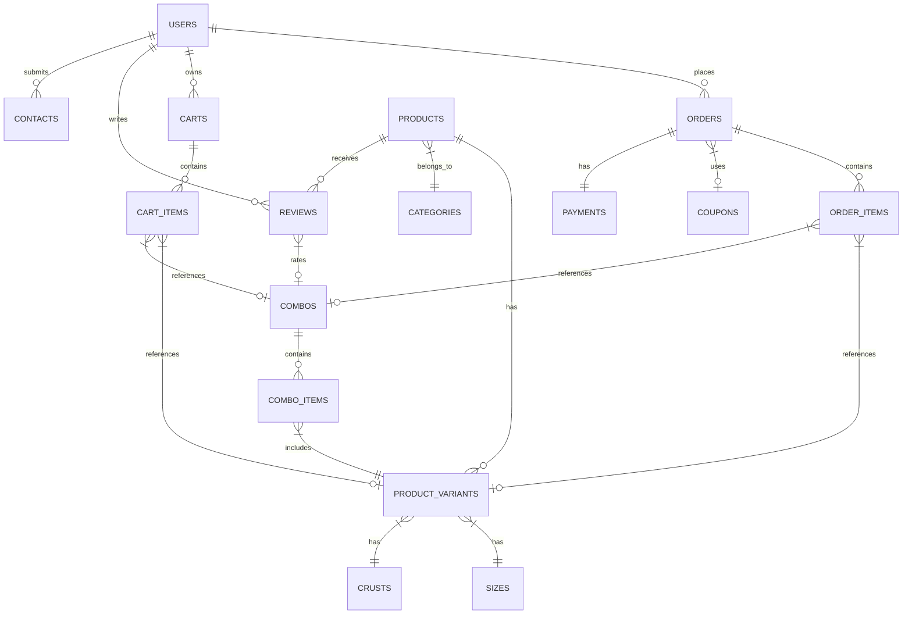

# 🍕 Pizza Shop - Website Bán Pizza Online

<div align="center">


[](https://github.com/pizzashop/releases)
[](LICENSE)
[](https://github.com/pizzashop/actions)
[](https://github.com/pizzashop/contributors)

**🚀 Website bán pizza trực tuyến hiện đại với đầy đủ chức năng quản lý và thanh toán**

[🌟 Demo Live](https://demo.pizzashop.com) • [📖 Documentation](https://docs.pizzashop.com) • [🐛 Report Bug](https://github.com/pizzashop/issues) • [💡 Request Feature](https://github.com/pizzashop/issues)

</div>

---

## 📋 Table of Contents

- [🌟 Giới thiệu](#-giới-thiệu)
- [✨ Tính năng nổi bật](#-tính-năng-nổi-bật)
- [🚀 Chức năng chính](#-chức-năng-chính)
- [🏗️ Cấu trúc Database](#️-cấu-trúc-database)
- [💻 Công nghệ sử dụng](#-công-nghệ-sử-dụng)
- [⚡ Quick Start](#-quick-start)
- [🔧 API Reference](#-api-reference)
- [🔒 Bảo mật](#-bảo-mật)
- [🎯 Roadmap](#-roadmap)
- [🤝 Contributing](#-contributing)

---

## 🌟 Giới thiệu

> **Pizza Shop** là một website thương mại điện tử chuyên về pizza, được thiết kế với trải nghiệm người dùng tối ưu và hệ thống quản lý mạnh mẽ.

### 🎯 Mục tiêu
- 🍕 Mang đến trải nghiệm đặt pizza online tuyệt vời
- 📱 Responsive design cho mọi thiết bị
- ⚡ Performance cao và tải trang nhanh
- 🔐 Bảo mật thông tin khách hàng tuyệt đối

---

## ✨ Tính năng nổi bật

<table>
<tr>
<td width="50%">

### 🛍️ **Cho Khách Hàng**
- 🏠 **Trang chủ hiện đại** với banner động
- 🍕 **Pizza customization** (size + đế)
- 🛒 **Smart cart** lưu trạng thái
- 💳 **Thanh toán đa dạng** (COD, Card, PayPal...)
- ⭐ **Review system** 5 sao
- 🎟️ **Mã giảm giá** thông minh
- 📱 **Mobile-first design**
- 🍱 **Combo deals** tiết kiệm

</td>
<td width="50%">

### 👨‍💼 **Cho Admin**
- 📊 **Dashboard** với charts realtime
- 📦 **Quản lý sản phẩm** advanced
- 🚚 **Order tracking** workflow
- 👥 **Customer management**
- 🎨 **Content management** (banners, news)
- 📈 **Analytics & Reports**
- 🔧 **System settings**
- 🎯 **Coupon management**

</td>
</tr>
</table>

---

## 🚀 Chức năng chính

### 🏠 **1. Trang chủ (Home Page)**


<details>
<summary>📋 Chi tiết chức năng</summary>

- **🎨 Hero Banner**: Slider với các promotion hot
- **🔥 Featured Products**: Top pizza bestseller
- **📰 Latest News**: Tin tức, khuyến mãi mới
- **⭐ Customer Reviews**: Đánh giá từ khách hàng
- **📍 Store Locator**: Bản đồ cửa hàng

</details>

---

### 🍕 **2. Quản lý sản phẩm**

<div align="center">

| 🏷️ **Danh mục** | 📝 **Mô tả** | 🎯 **Đặc điểm** |
|:---:|:---:|:---:|
| 🦐 Pizza Hải Sản | Tôm, cua, mực tươi | Premium ingredients |
| 🥬 Pizza Chay | 100% thuần chay | Healthy choice |
| 🥩 Pizza Thịt | Pepperoni, xúc xích | Classic flavors |
| 🧀 Pizza Phô Mai | 4 loại phô mai | Cheese lovers |
| 🍕 Pizza Truyền Thống | Công thức cổ điển | Authentic taste |
| ⭐ Pizza Đặc Biệt | Sáng tạo độc quyền | Chef's special |
| 🥤 Nước Uống | Giải khát đa dạng | Fresh drinks |
| 🍰 Tráng Miệng | Bánh ngọt, kem | Sweet endings |
| 🍟 Món Ăn Kèm | Khoai tây chiên, gà chiên | Side dishes |
| 🎁 Combo Khuyến Mãi | Combo giá ưu đãi | Value packages |

</div>

**🎛️ Tùy chọn Pizza:**

```yaml
Sizes:
  - 🔸 Mini (12cm): Perfect for kids
  - 🔹 Siêu Nhỏ (15cm): Light meal
  - 🔸 Cỡ Nhỏ Đặc Biệt (18cm): Individual  
  - 🔹 Nhỏ (20cm): Single serving
  - 🔶 Cỡ Trung (22.5cm): For couples
  - 🔷 Vừa (25cm): For 2-3 people
  - 🔶 Lớn (30cm): Family size
  - 🔷 Cỡ Lớn Đặc Biệt (32cm): Extra large
  - 🟠 Cỡ Đại (35cm): Party size
  - 🟡 Gia Đình (40cm): Super family

Crusts:
  - 🥖 Đế Mỏng: Crispy & light
  - 🍞 Đế Dày: Soft & fluffy  
  - 🧀 Viền Phô Mai: Cheese-stuffed crust
  - 🌭 Đế Nhân Nhồi: Sausage-filled
  - 🔥 Đế Giòn: Extra crispy
  - 🌿 Đế Nguyên Cám: Whole wheat healthy
  - 🚫 Đế Không Gluten: Gluten-free option
  - 🧄 Đế Hành Lá: Green onion flavored
  - 🌶️ Đế Tiêu Đen: Black pepper crust
  - 🌿 Đế Thảo Mộc: Italian herbs
```

---


**✨ Features:**
- 🔄 **Auto-sync** cho user đăng nhập
- 💾 **Persistent storage** với database
- 🍪 **Session storage** cho guest
- ⚡ **Real-time updates** khi thay đổi
- 🧮 **Auto-calculate** tổng tiền, thuế, phí ship
- 🍱 **Combo support** - có thể thêm cả sản phẩm lẻ và combo

---

### 🍱 **4. Hệ thống Combo**



**🎯 Combo Features:**
- 🎁 **Bundle Products**: Kết hợp nhiều sản phẩm với giá ưu đãi
- 📅 **Time-limited**: Có thời hạn bắt đầu và kết thúc
- 💰 **Special Pricing**: Giá combo thấp hơn mua lẻ
- 🔄 **Flexible Quantities**: Số lượng linh hoạt cho từng item
- 📱 **Easy Management**: Admin dễ dàng tạo/chỉnh sửa combo

---

### 💳 **5. Hệ thống thanh toán**

<div align="center">

| 💳 **Phương thức** | 🏷️ **Phí** | ⏱️ **Xử lý** | 🔒 **Bảo mật** |
|:---:|:---:|:---:|:---:|
| 💵 Cash (COD) | Miễn phí | Tức thì | ⭐⭐⭐ |
| 💳 Credit Card | 2.9% | 1-3 phút | ⭐⭐⭐⭐⭐ |
| 🏦 Bank Transfer | Miễn phí | 15-30 phút | ⭐⭐⭐⭐ |
| 💙 PayPal | 3.4% | Tức thì | ⭐⭐⭐⭐⭐ |

</div>

**💡 Payment Features:**
- 🛡️ **One Payment Rule**: Mỗi đơn hàng chỉ có 1 payment thành công
- 🔄 **Status Tracking**: Pending → Completed/Failed
- 🧾 **Transaction ID**: Lưu trữ mã giao dịch
- 📊 **Payment Analytics**: Thống kê theo phương thức

---

### 👤 **6. Quản lý tài khoản**

```yaml
Authentication:
  📝 Register: Email verification required
  🔐 Login: Username/Email + Password
  🔑 Password Reset: OTP via email/SMS
  👤 Profile Management: Update info anytime

User Dashboard:
  📊 Overview: Order stats, points earned
  📦 Order History: Track all purchases  
  ⭐ Reviews: Rate & comment products/combos
  🎟️ Coupons: Available vouchers
  📍 Addresses: Multiple delivery locations
  🔔 Notifications: Order updates, promotions
```

---

### 🔧 **7. Admin Panel**

<div align="center">



</div>

**🎯 Key Features:**
- 📈 **Real-time Dashboard** với charts động
- 🔄 **Bulk Operations** cho products/orders
- 📱 **Mobile Admin** responsive design
- 🔔 **Push Notifications** cho orders mới
- 📊 **Advanced Analytics** với filters
- 🎨 **WYSIWYG Editor** cho content
- 🍱 **Combo Management** tạo và quản lý combo
- 🎟️ **Smart Coupons** với điều kiện phức tạp

---

### 🎟️ **8. Hệ thống khuyến mãi**

<table>
<tr>
<td width="33%">

#### 💯 **Percentage Discount**
```yaml
Examples:
  PIZZA10: 10% off (min 200k, max 50k)
  SUMMER20: 20% off (min 300k, max 100k)
  FLASH25: 25% off (min 500k, max 150k)
  VIP15: 15% off (min 250k, max 75k)

Features:
  ✅ Min order amount
  ✅ Max discount cap
  ✅ Expiry date
  ✅ Active/Inactive status
```

</td>
<td width="33%">

#### 💰 **Fixed Amount**
```yaml
Examples:
  FREESHIP: -30k shipping (min 150k)
  NEWUSER: -50k first order (min 100k)
  COMBO50: -50k combo deals (min 400k)
  PIZZADAY: -20k special day (min 150k)

Benefits:
  ✅ Easy to understand
  ✅ Great for small orders
  ✅ Shipping incentives
  ✅ New customer attraction
```

</td>
<td width="34%">

#### 🎁 **Smart Validation**
```yaml
Business Rules:
  ⚡ Either percentage OR amount
  ⚡ Not both at same time
  ⚡ Auto-check minimum order
  ⚡ Validate expiry date
  ⚡ Usage tracking

Database Constraints:
  ✅ CHECK constraints
  ✅ UNIQUE coupon codes
  ✅ Proper data types
  ✅ Audit timestamps
```

</td>
</tr>
</table>

---

## 🏗️ Cấu trúc Database

### 📊 **Database Schema Overview**



### 🗃️ **Core Tables**

<details>
<summary>👥 <strong>Users & Authentication</strong></summary>

```sql
-- 👤 Users: Customer & Admin accounts
users (
  id, username, password, email, full_name, 
  address, phone, role[customer|admin], 
  created_at, updated_at
)

-- 📞 Contacts: Customer inquiries (flexible user/guest)
contacts (
  id, user_id?, name?, email, message, 
  created_at, updated_at
)
-- Logic: user_id thì auto-fill name/email, guest thì required name/email
```
</details>

<details>
<summary>🍕 <strong>Products & Catalog</strong></summary>

```sql
-- 🏷️ Categories: 10 product types
categories (id, name, description, created_at, updated_at)

-- 🍕 Products: Pizza and items  
products (id, name, description, image_url, category_id, timestamps)

-- 📏 Sizes: 10 pizza dimensions
sizes (id, name, diameter, created_at, updated_at)

-- 🥖 Crusts: 10 pizza base types
crusts (id, name, description, created_at, updated_at)

-- 🎛️ Product Variants: Price combinations
product_variants (
  id, product_id, size_id?, crust_id?, 
  price, stock, created_at, updated_at
)
-- Logic: Pizza cần size+crust, non-pizza thì NULL
```
</details>

<details>
<summary>🛒 <strong>Shopping & Orders</strong></summary>

```sql
-- 🛒 Carts: Shopping baskets (user-based)
carts (id, user_id, created_at, updated_at)

-- 📦 Cart Items: Products OR combos in cart
cart_items (
  id, cart_id, product_variant_id?, combo_id?, 
  quantity, created_at, updated_at
)
-- Logic: Either product_variant_id OR combo_id (XOR)

-- 🛍️ Orders: Purchase records with auto-total
orders (
  id, user_id, total_amount[auto-calculated], 
  status[pending|confirmed|shipped|delivered|cancelled], 
  shipping_address, coupon_id?, created_at, updated_at
)

-- 📋 Order Items: Products OR combos in order
order_items (
  id, order_id, product_variant_id?, combo_id?, 
  quantity, price, created_at, updated_at
)
-- Logic: Either product_variant_id OR combo_id (XOR)

-- 💳 Payments: One completed payment per order
payments (
  id, order_id, amount, 
  method[cash|credit_card|bank_transfer|paypal], 
  status[pending|completed|failed], 
  transaction_id?, created_at, updated_at
)
```
</details>

<details>
<summary>🍱 <strong>Combos & Bundles</strong></summary>

```sql
-- 🍱 Combos: Bundle deals with time limits
combos (
  id, name, description, price, image_url,
  start_date?, end_date?, is_active, 
  created_at, updated_at
)

-- 📋 Combo Items: Products included in combo
combo_items (
  id, combo_id, product_variant_id, 
  quantity, created_at, updated_at
)
```
</details>

<details>
<summary>🎯 <strong>Marketing & Content</strong></summary>

```sql
-- 🎟️ Coupons: Smart discount system
coupons (
  id, code[unique], discount_percentage?, discount_amount?, 
  expiry_date?, min_order_amount?, max_discount_amount?,
  is_active, created_at, updated_at
)
-- Logic: Either percentage OR amount (XOR)

-- ⭐ Reviews: Product OR combo ratings
reviews (
  id, product_id?, combo_id?, user_id, 
  rating[1-5], comment?, created_at, updated_at
)
-- Logic: Either product_id OR combo_id (XOR)
-- Unique: user can review each product/combo only once

-- 🎨 Banners: Position-based ads
banners (
  id, image_url, link?, 
  position[homepage_top|homepage_bottom|product_page], 
  active, created_at, updated_at
)

-- 📰 News: Company updates
news (id, title, content, image_url?, created_at, updated_at)

-- ❓ FAQ: Customer support
faq (id, question, answer, created_at, updated_at)
```
</details>

### 📈 **Sample Data Overview**

<div align="center">

| 📊 **Table** | 🔢 **Records** | 📝 **Description** |
|:---:|:---:|:---|
| 👥 Users | 10 | 8 customers + 2 admins |
| 🏷️ Categories | 10 | Pizza types, drinks, desserts, combos |
| 🍕 Products | 10 | Various pizzas and items |
| 📏 Sizes | 10 | From mini (12cm) to family (40cm) |
| 🥖 Crusts | 10 | Thin, thick, stuffed, specialty crusts |
| 🎛️ Product Variants | 11 | Size+crust combinations with prices |
| 🍱 Combos | 2 | Couple combo & Family combo |
| 📋 Combo Items | 6 | Products included in combos |
| 🎟️ Coupons | 10 | Percentage & fixed discounts |
| 🛍️ Orders | 10 | Different statuses & customers |
| 📦 Order Items | 11 | Mix of products and combos |
| 💳 Payments | 10 | Various payment methods |
| ⭐ Reviews | 10 | 1-5 star ratings with comments |
| 🛒 Carts | 8 | Active customer carts |
| 🎨 Banners | 10 | Homepage & product page ads |
| 📰 News | 10 | Promotions & updates |
| ❓ FAQ | 10 | Common questions & answers |
| 📞 Contacts | 10 | Customer inquiries (mix users/guests) |

</div>

---

### 🔧 **Advanced Database Features**

#### 🛡️ **Triggers & Constraints**

```sql
-- ✅ Order Items Validation
-- Đảm bảo order_items có EITHER product_variant_id OR combo_id (không cả hai, không thiếu)

-- ✅ Cart Items Validation  
-- Đảm bảo cart_items có EITHER product_variant_id OR combo_id

-- ✅ Auto Total Calculation
-- Tự động tính total_amount khi thêm/sửa/xóa order_items

-- ✅ Payment Validation
-- Mỗi order chỉ có thể có 1 payment với status 'completed'

-- ✅ Contact Logic
-- Nếu user_id có thì auto-fill name/email từ users table
-- Nếu guest thì require name và email

-- ✅ Coupon Validation
-- Either discount_percentage OR discount_amount (không cả hai)

-- ✅ Review Constraints
-- User chỉ có thể review mỗi product/combo 1 lần
-- Either product_id OR combo_id (không cả hai)
```

#### 📊 **Indexes for Performance**

```sql
-- 🚀 Optimized queries
idx_orders_user_id              -- Fast user order lookup
idx_order_items_order_id        -- Quick order details
idx_cart_items_cart_id          -- Instant cart loading
idx_payments_order_id           -- Payment tracking
idx_reviews_user_id             -- User reviews
idx_products_category_id        -- Category filtering
idx_combo_items_combo_id        -- Combo details
idx_cart_items_product_variant_id -- Cart product lookup
idx_order_items_product_variant_id -- Order product lookup
```

---

## 💻 Công nghệ sử dụng

### 🏗️ **Tech Stack**

<div align="center">


</div>

### Backend Options

<table>
<tr>
<td width="33%">

#### 🐘 **PHP Stack**
```yaml
Core: PHP 8.1+
Framework: Laravel/CodeIgniter
Database: MySQL 8.0+
Server: Apache/Nginx
Cache: Redis
ORM: Eloquent/Active Record
```

</td>
<td width="33%">

#### 🟢 **Node.js Stack**  
```yaml
Runtime: Node.js 18+
Framework: Express.js
Database: MySQL + Sequelize
Auth: JWT/Passport
Cache: Redis
Validation: Joi/Yup
```

</td>
<td width="34%">

#### 🐍 **Python Stack**
```yaml
Language: Python 3.9+
Framework: Django/FastAPI  
Database: MySQL + SQLAlchemy
Auth: Django Auth/OAuth2
Cache: Redis
Validation: Pydantic
```

</td>
</tr>
</table>

### Frontend Technologies

```yaml
🎨 Core:
  - HTML5 semantic markup
  - CSS3 with Flexbox/Grid
  - Vanilla JavaScript ES6+
  - Responsive design principles

📱 Frameworks (Optional):
  - React.js with hooks
  - Vue.js 3 composition API
  - Bootstrap 5 / Tailwind CSS
  - SCSS for advanced styling

⚡ Performance:
  - Lazy loading images
  - Code splitting
  - Service workers
  - CDN integration
```

---

## ⚡ Quick Start

### 🚀 **Installation**

<details>
<summary>🐳 <strong>Docker Setup (Recommended)</strong></summary>

```bash
# Clone repository
git clone https://github.com/yourusername/pizza-shop.git
cd pizza-shop

# Start with Docker Compose
docker-compose up -d

# Import database
docker exec -i pizza_shop_db mysql -u root -ppassword pizza_shop < database/pizza_shop.sql

# Access application
open http://localhost:8080
```

</details>

<details>
<summary>💻 <strong>Manual Setup</strong></summary>

```bash
# 1️⃣ Clone & Setup
git clone https://github.com/yourusername/pizza-shop.git
cd pizza-shop

# 2️⃣ Database Setup
mysql -u root -p
CREATE DATABASE pizza_shop;
mysql -u root -p pizza_shop < database/pizza_shop.sql

# 3️⃣ PHP Setup
composer install
cp .env.example .env
php artisan key:generate
php artisan serve

# 4️⃣ Node.js Setup (Alternative)
npm install
cp .env.example .env
npm run dev
```

</details>

### ⚙️ **Configuration**

```yaml
# .env file
APP_NAME=Pizza Shop
APP_URL=http://localhost:8000
APP_DEBUG=true

DB_CONNECTION=mysql
DB_HOST=127.0.0.1
DB_PORT=3306
DB_DATABASE=pizza_shop
DB_USERNAME=your_username
DB_PASSWORD=your_password

MAIL_MAILER=smtp
MAIL_HOST=smtp.gmail.com
MAIL_PORT=587
MAIL_USERNAME=your_email@gmail.com
MAIL_PASSWORD=your_app_password

PAYMENT_STRIPE_KEY=sk_test_...
PAYMENT_PAYPAL_CLIENT_ID=your_paypal_id
```

---

# 🔧 Tài liệu API

## 🔐 **API Xác thực**

```http
POST   /api/auth/login             # 🔐 Đăng nhập người dùng
GET    /api/auth/me               # 👤 Lấy thông tin người dùng hiện tại
POST   /api/auth/logout           # 🚪 Đăng xuất người dùng
GET    /api/profile               # 👤 Lấy thông tin hồ sơ (yêu cầu đăng nhập)
```

## 🍕 **API Sản phẩm**

```http
GET    /api/products               # 📋 Danh sách tất cả sản phẩm
POST   /api/products               # ➕ Tạo sản phẩm mới (admin)
GET    /api/products/featured      # ⭐ Sản phẩm nổi bật
GET    /api/products/{id}          # 🔍 Chi tiết sản phẩm
PUT    /api/products/{id}          # ✏️ Cập nhật sản phẩm (admin)
DELETE /api/products/{id}          # 🗑️ Xóa sản phẩm (admin)
```

## 🏷️ **API Danh mục**

```http
GET    /api/categories             # 📋 Danh sách danh mục
POST   /api/categories             # ➕ Tạo danh mục mới (admin)
GET    /api/categories/{id}        # 🔍 Chi tiết danh mục
PUT    /api/categories/{id}        # ✏️ Cập nhật danh mục (admin)
DELETE /api/categories/{id}        # 🗑️ Xóa danh mục (admin)
```

## 📏 **API Kích thước & Loại đế**

```http
GET    /api/sizes                  # 📏 Danh sách kích thước
POST   /api/sizes                  # ➕ Tạo kích thước mới (admin)
GET    /api/sizes/{id}             # 🔍 Chi tiết kích thước
PUT    /api/sizes/{id}             # ✏️ Cập nhật kích thước (admin)
DELETE /api/sizes/{id}             # 🗑️ Xóa kích thước (admin)

GET    /api/crusts                 # 🥖 Danh sách loại đế pizza
POST   /api/crusts                 # ➕ Tạo loại đế mới (admin)
GET    /api/crusts/{id}            # 🔍 Chi tiết loại đế
PUT    /api/crusts/{id}            # ✏️ Cập nhật loại đế (admin)
DELETE /api/crusts/{id}            # 🗑️ Xóa loại đế (admin)
```

## 🛒 **API Giỏ hàng**

```http
GET    /api/cart/products          # 📋 Lấy tất cả sản phẩm cho giỏ hàng
GET    /api/cart                   # 👀 Xem giỏ hàng (yêu cầu đăng nhập)
POST   /api/cart/items             # ➕ Thêm vào giỏ hàng (yêu cầu đăng nhập)
PUT    /api/cart/items/{itemId}    # ✏️ Cập nhật sản phẩm trong giỏ (yêu cầu đăng nhập)
DELETE /api/cart/items/{itemId}    # 🗑️ Xóa khỏi giỏ hàng (yêu cầu đăng nhập)
DELETE /api/cart/clear             # 🧹 Xóa toàn bộ giỏ hàng (yêu cầu đăng nhập)
```

## 🍱 **API Combo**

```http
GET    /api/combos                 # 🍱 Danh sách tất cả combo
POST   /api/combos                 # ➕ Tạo combo mới (admin)
GET    /api/combos/active          # ✅ Combo đang hoạt động
GET    /api/combos/{id}            # 🔍 Chi tiết combo
PUT    /api/combos/{id}            # ✏️ Cập nhật combo (admin)
DELETE /api/combos/{id}            # 🗑️ Xóa combo (admin)
```

## 🍕 **API Sản phẩm trong Combo**

```http
GET    /api/combo-items/{id}       # 🔍 Chi tiết sản phẩm trong combo
PUT    /api/combo-items/{id}       # ✏️ Cập nhật sản phẩm trong combo
DELETE /api/combo-items/{id}       # 🗑️ Xóa sản phẩm khỏi combo
```

## 🛍️ **API Đơn hàng**

```http
GET    /api/orders                 # 📋 Danh sách đơn hàng (yêu cầu đăng nhập)
POST   /api/orders                 # 🛍️ Tạo đơn hàng mới (yêu cầu đăng nhập)
GET    /api/orders/{id}            # 🔍 Chi tiết đơn hàng (yêu cầu đăng nhập)
PATCH  /api/orders/{id}/status     # ✏️ Cập nhật trạng thái đơn hàng
POST   /api/orders/{id}/cancel     # ❌ Hủy đơn hàng (yêu cầu đăng nhập)
```

## 📦 **API Chi tiết đơn hàng**

```http
GET    /api/order-items            # 📋 Danh sách chi tiết đơn hàng (yêu cầu đăng nhập)
POST   /api/order-items            # ➕ Thêm sản phẩm vào đơn hàng (yêu cầu đăng nhập)
GET    /api/order-items/{id}       # 🔍 Chi tiết sản phẩm trong đơn hàng (yêu cầu đăng nhập)
PUT    /api/order-items/{id}       # ✏️ Cập nhật sản phẩm trong đơn hàng (yêu cầu đăng nhập)
DELETE /api/order-items/{id}       # 🗑️ Xóa sản phẩm khỏi đơn hàng (yêu cầu đăng nhập)
GET    /api/order-items/by-order/{orderId}           # 📦 Lấy chi tiết theo đơn hàng (yêu cầu đăng nhập)
GET    /api/order-items/stats/best-selling-products  # 📊 Sản phẩm bán chạy nhất (yêu cầu đăng nhập)
GET    /api/order-items/stats/best-selling-combos    # 📊 Combo bán chạy nhất (yêu cầu đăng nhập)
```

## 💳 **API Thanh toán**

```http
GET    /api/payments               # 📋 Danh sách thanh toán (yêu cầu đăng nhập)
POST   /api/payments               # ➕ Tạo thanh toán mới (yêu cầu đăng nhập)
GET    /api/payments/{id}          # 🔍 Chi tiết thanh toán (yêu cầu đăng nhập)
PATCH  /api/payments/{id}/status   # ✏️ Cập nhật trạng thái thanh toán
```

## 🎟️ **API Mã giảm giá**

```http
GET    /api/coupons                # 📋 Danh sách mã giảm giá
POST   /api/coupons                # ➕ Tạo mã giảm giá mới (admin)
GET    /api/coupons/{id}           # 🔍 Chi tiết mã giảm giá
PUT    /api/coupons/{id}           # ✏️ Cập nhật mã giảm giá (admin)
DELETE /api/coupons/{id}           # 🗑️ Xóa mã giảm giá (admin)
POST   /api/coupons/validate       # ✅ Kiểm tra tính hợp lệ của mã giảm giá
```

## 🔧 **API Biến thể sản phẩm**

```http
GET    /api/product-variants       # 📋 Danh sách biến thể sản phẩm
POST   /api/product-variants       # ➕ Tạo biến thể mới (admin)
GET    /api/product-variants/{id}  # 🔍 Chi tiết biến thể
PUT    /api/product-variants/{id}  # ✏️ Cập nhật biến thể (admin)
DELETE /api/product-variants/{id}  # 🗑️ Xóa biến thể (admin)
```

## ⭐ **API Đánh giá**

```http
GET    /api/reviews                # 📋 Danh sách đánh giá (yêu cầu đăng nhập)
POST   /api/reviews                # ➕ Tạo đánh giá mới (yêu cầu đăng nhập)
GET    /api/reviews/{id}           # 🔍 Chi tiết đánh giá (yêu cầu đăng nhập)
PUT    /api/reviews/{id}           # ✏️ Cập nhật đánh giá (yêu cầu đăng nhập)
PATCH  /api/reviews/{id}           # ✏️ Cập nhật đánh giá (yêu cầu đăng nhập)
DELETE /api/reviews/{id}           # 🗑️ Xóa đánh giá (yêu cầu đăng nhập)
```

## 👥 **API Người dùng**

```http
GET    /api/users                  # 📋 Danh sách người dùng (admin)
POST   /api/users                  # ➕ Tạo người dùng mới (admin)
GET    /api/users/{id}             # 🔍 Chi tiết người dùng (admin)
PUT    /api/users/{id}             # ✏️ Cập nhật người dùng (admin)
PATCH  /api/users/{id}             # ✏️ Cập nhật người dùng (admin)
DELETE /api/users/{id}             # 🗑️ Xóa người dùng (admin)
```

## 🎨 **API Quản lý Banner**

```http
GET    /api/banners                # 🎨 Danh sách banner
POST   /api/banners                # ➕ Tạo banner mới (admin)
GET    /api/banners/{id}           # 🔍 Chi tiết banner
PUT    /api/banners/{id}           # ✏️ Cập nhật banner (admin)
DELETE /api/banners/{id}           # 🗑️ Xóa banner (admin)
```

## 📰 **API Tin tức**

```http
GET    /api/news                   # 📰 Danh sách tin tức
POST   /api/news                   # ➕ Tạo tin tức mới (admin)
GET    /api/news/latest/{count?}   # 📰 Tin tức mới nhất (count tùy chọn)
GET    /api/news/{id}              # 🔍 Chi tiết tin tức
PUT    /api/news/{id}              # ✏️ Cập nhật tin tức (admin)
DELETE /api/news/{id}              # 🗑️ Xóa tin tức (admin)
```

## ❓ **API Câu hỏi thường gặp**

```http
GET    /api/faqs                   # ❓ Danh sách FAQ
POST   /api/faqs                   # ➕ Tạo FAQ mới (admin)
GET    /api/faqs/{id}              # 🔍 Chi tiết FAQ
PUT    /api/faqs/{id}              # ✏️ Cập nhật FAQ (admin)
DELETE /api/faqs/{id}              # 🗑️ Xóa FAQ (admin)
```

## 📞 **API Liên hệ**

```http
GET    /api/contacts               # 📋 Danh sách liên hệ (admin)
POST   /api/contacts               # 📞 Gửi form liên hệ
GET    /api/contacts/{id}          # 🔍 Chi tiết liên hệ (admin)
DELETE /api/contacts/{id}          # 🗑️ Xóa liên hệ (admin)
```

## 🔒 **API Quên mật khẩu**

```http
POST   /api/password/forgot        # 📧 Gửi email đặt lại mật khẩu
POST   /api/password/verify-token  # ✅ Xác thực token reset
POST   /api/password/reset         # 🔑 Đặt lại mật khẩu mới
POST   /api/password/cancel-reset  # ❌ Hủy yêu cầu reset
GET    /reset-password             # 📝 Form đặt lại mật khẩu (Web)
```

### **Chi tiết API:**

**1. Gửi email đặt lại mật khẩu**
```http
POST /api/password/forgot
Content-Type: application/json

{
    "email": "user@example.com"
}

# Response Success (200)
{
    "message": "Password reset email sent successfully",
    "expires_in": "15 phút"
}

# Response Error (404/429)
{
    "error": "Email does not exist"
    // hoặc "You can only request a password reset once every 5 minutes"
}
```

**2. Xác thực token reset**
```http
POST /api/password/verify-token
Content-Type: application/json

{
    "email": "user@example.com",
    "token": "QlrgjJUkSFuaoxIzjKLNwrGly81ppzvYiHox6qHk..."
}

# Response Success (200)
{
    "valid": true,
    "email": "user@example.com",
    "username": "john_doe",
    "expires_at": "2025-09-01T10:15:00.000Z",
    "time_remaining": "12 phút"
}

# Response Error (400)
{
    "valid": false,
    "error": "Token không hợp lệ hoặc đã hết hạn"
}
```

**3. Đặt lại mật khẩu**
```http
POST /api/password/reset
Content-Type: application/json

{
    "email": "user@example.com",
    "token": "QlrgjJUkSFuaoxIzjKLNwrGly81ppzvYiHox6qHk...",
    "password": "newpassword123",
    "password_confirmation": "newpassword123"
}

# Response Success (200)
{
    "message": "Mật khẩu đã được cập nhật thành công. Vui lòng đăng nhập lại với mật khẩu mới."
}

# Response Error (400)
{
    "error": "Token đã hết hạn"
}
```

**4. Hủy yêu cầu reset**
```http
POST /api/password/cancel-reset
Content-Type: application/json

{
    "email": "user@example.com"
}

# Response Success (200)
{
    "message": "Yêu cầu đặt lại mật khẩu đã được hủy"
}
```

**5. Form đặt lại mật khẩu (Web Interface)**
```http
GET /reset-password?email=user@example.com&token=abc123
# Hiển thị giao diện form để người dùng nhập mật khẩu mới
```

### **🔐 Bảo mật & Giới hạn:**
- ⏱️ Token có hiệu lực **15 phút**
- 🔄 Chỉ sử dụng **1 lần duy nhất**
- 🚫 Rate limit: **1 lần/5 phút** mỗi email
- 📧 Email template responsive với thiết kế Pizza Shop
- 🛡️ Token được lưu trong cache, tự động xóa sau khi sử dụng

### **📝 Flow hoạt động:**
1. User nhập email → `POST /api/password/forgot`
2. Nhận email với link reset → Click vào link
3. Mở form → `GET /reset-password?email=...&token=...`
4. Form tự động verify token → `POST /api/password/verify-token`
5. User nhập mật khẩu mới → `POST /api/password/reset`

---

## 📝 **Chi tiết tham số và response**

### 🔐 Đăng nhập
**POST** `/api/auth/login`
```json
// Request
{
  "email": "user@example.com",
  "password": "password123"
}

// Response
{
  "success": true,
  "token": "jwt_token_here",
  "user": { ... }
}
```

### 🛒 Thêm vào giỏ hàng
**POST** `/api/cart/items`
```json
// Request (Sản phẩm)
{
  "product_variant_id": 1,
  "quantity": 2
}

// Request (Combo)
{
  "combo_id": 1,
  "quantity": 1
}
```

### 🛍️ Tạo đơn hàng
**POST** `/api/orders`
```json
// Request
{
  "shipping_address": "123 Đường ABC, Quận 1, TP.HCM",
  "coupon_code": "DISCOUNT10"
}
```

### ✅ Kiểm tra mã giảm giá
**POST** `/api/coupons/validate`
```json
// Request
{
  "code": "DISCOUNT10",
  "order_amount": 500000
}

// Response
{
  "valid": true,
  "coupon": { ... },
  "discount": 50000
}
```

### ⭐ Tạo đánh giá
**POST** `/api/reviews`
```json
// Request (Đánh giá sản phẩm)
{
  "product_id": 1,
  "rating": 5,
  "comment": "Pizza rất ngon!"
}

// Request (Đánh giá combo)
{
  "combo_id": 1,
  "rating": 4,
  "comment": "Combo tuyệt vời!"
}
```

### 📊 Thống kê sản phẩm bán chạy
**GET** `/api/order-items/stats/best-selling-products?days=30&limit=10`

### 📊 Thống kê combo bán chạy
**GET** `/api/order-items/stats/best-selling-combos?days=30&limit=10`

---

## 🔒 **Yêu cầu xác thực**

- 🟢 **Công khai**: Có thể truy cập mà không cần đăng nhập
- 🔐 **Yêu cầu đăng nhập**: Cần JWT token trong header `Authorization: Bearer {token}`
- 👑 **Admin**: Chỉ admin mới có thể truy cập

## 📊 **Các tham số query phổ biến**

- `?active=true/false` - Lọc theo trạng thái hoạt động
- `?search=keyword` - Tìm kiếm theo từ khóa
- `?status=pending/confirmed/shipped/delivered/cancelled` - Lọc theo trạng thái
- `?days=30` - Thống kê trong X ngày
- `?limit=10` - Giới hạn số kết quả
- `?position=homepage_top/homepage_bottom/product_page` - Lọc banner theo vị trí
---


# 📊 Revenue Statistics API Documentation

## **Revenue API Endpoints**

```http
GET    /api/revenue/daily          # 📅 Thống kê doanh thu theo ngày
GET    /api/revenue/weekly         # 📅 Thống kê doanh thu theo tuần  
GET    /api/revenue/monthly        # 📅 Thống kê doanh thu theo tháng
GET    /api/revenue/yearly         # 📅 Thống kê doanh thu theo năm

GET    /api/revenue/top-products   # 🏆 Top sản phẩm bán chạy nhất
GET    /api/revenue/combo          # 🎯 Thống kê doanh thu combo

GET    /api/revenue/top-customers  # 👑 Top khách hàng VIP

GET    /api/revenue/coupons        # 🎟️ Thống kê doanh thu theo coupon

GET    /api/revenue/dashboard      # 📈 Tổng quan dashboard
```

---

## **📊 1. THỐNG KÊ DOANH THU THEO THỜI GIAN**

### **1.1 Doanh thu theo ngày**
```http
GET /api/revenue/daily?date=05/09/2025

# Response Success (200)
{
    "data": [
        {
            "date": "05/09/2025",
            "total_revenue": "2500000.00",
            "total_orders": 45,
            "avg_order_value": "555555.56"
        }
    ]
}

# Response Error (400)
{
    "error": "Invalid date format. Please use d/m/Y (e.g., 04/09/2025)."
}
```

**Parameters:**
- `date` (optional): Ngày cần thống kê (format: d/m/Y). Mặc định: hôm nay

---

### **1.2 Doanh thu theo tuần**
```http
GET /api/revenue/weekly?year=2025&week=36

# Response Success (200)
{
    "data": [
        {
            "week": 36,
            "year": 2025,
            "total_revenue": "15000000.00",
            "total_orders": 280
        }
    ]
}

# Response Error (400)
{
    "error": "Invalid year or week number."
}
```

**Parameters:**
- `year` (optional): Năm cần thống kê. Mặc định: năm hiện tại
- `week` (optional): Tuần cần thống kê (1-53). Mặc định: tuần hiện tại

---

### **1.3 Doanh thu theo tháng**
```http
GET /api/revenue/monthly?year=2025&month=9

# Response Success (200)
{
    "data": [
        {
            "month": 9,
            "year": 2025,
            "month_name": "09/2025",
            "total_revenue": "50000000.00",
            "total_orders": 850,
            "avg_order_value": "588235.29"
        }
    ]
}

# Response Error (400)
{
    "error": "Invalid month format. Month must be a number between 1 and 12."
}
```

**Parameters:**
- `year` (optional): Năm cần thống kê. Mặc định: năm hiện tại
- `month` (optional): Tháng cần thống kê (1-12). Nếu không có sẽ lấy tất cả tháng trong năm

---

### **1.4 Doanh thu theo năm**
```http
GET /api/revenue/yearly?year=2025

# Response Success (200)
{
    "data": [
        {
            "year": 2025,
            "total_revenue": "500000000.00",
            "total_orders": 8500,
            "avg_order_value": "588235.29"
        }
    ]
}

# Response Error (400)
{
    "error": "Invalid year format. Year must be a number between 1900 and 9999."
}
```

**Parameters:**
- `year` (optional): Năm cần thống kê. Nếu không có sẽ lấy tất cả năm

---

## **🏆 2. THỐNG KÊ DOANH THU THEO SẢN PHẨM**

### **2.1 Top sản phẩm bán chạy**
```http
GET /api/revenue/top-products?limit=10

# Response Success (200)
{
    "data": [
        {
            "product_name": "Pizza Margherita",
            "size_name": "Large",
            "crust_name": "Thin Crust",
            "total_sold": 150,
            "total_revenue": "7500000.00",
            "avg_price": "50000.00"
        },
        {
            "product_name": "Pizza Hawaii",
            "size_name": "Medium",
            "crust_name": "Thick Crust",
            "total_sold": 120,
            "total_revenue": "6000000.00",
            "avg_price": "50000.00"
        }
    ]
}

# Response Error (400)
{
    "error": "Invalid limit value."
}
```

**Parameters:**
- `limit` (optional): Số lượng sản phẩm trả về. Mặc định: 10

---

### **2.2 Doanh thu combo**
```http
GET /api/revenue/combo?limit=10

# Response Success (200)
{
    "data": [
        {
            "combo_name": "Family Deluxe",
            "total_sold": 80,
            "total_revenue": "12000000.00",
            "combo_price": "150000.00",
            "total_orders": 65
        },
        {
            "combo_name": "Couple Special",
            "total_sold": 95,
            "total_revenue": "9500000.00",
            "combo_price": "100000.00",
            "total_orders": 78
        }
    ]
}

# Response Error (500)
{
    "error": "Database query failed: [error message]"
}
```

**Parameters:**
- `limit` (optional): Số lượng combo trả về. Mặc định: 10

---

## **👑 3. THỐNG KÊ DOANH THU THEO KHÁCH HÀNG**

### **3.1 Top khách hàng VIP**
```http
GET /api/revenue/top-customers?limit=20

# Response Success (200)
{
    "data": [
        {
            "full_name": "Nguyễn Văn A",
            "email": "nguyenvana@example.com",
            "phone": "0901234567",
            "total_orders": 25,
            "total_spent": "5000000.00",
            "avg_order_value": "200000.00",
            "last_order_date": "05/09/2025"
        },
        {
            "full_name": "Trần Thị B",
            "email": "tranthib@example.com", 
            "phone": "0987654321",
            "total_orders": 20,
            "total_spent": "4500000.00",
            "avg_order_value": "225000.00",
            "last_order_date": "03/09/2025"
        }
    ]
}

# Response Error (400)
{
    "error": "Invalid limit value."
}
```

**Parameters:**
- `limit` (optional): Số lượng khách hàng trả về. Mặc định: 20

---

## **🎟️ 4. THỐNG KÊ DOANH THU THEO COUPON**

### **4.1 Doanh thu với coupon**
```http
GET /api/revenue/coupons

# Response Success (200)
{
    "data": [
        {
            "coupon_code": "WELCOME10",
            "discount_percentage": 10.00,
            "discount_amount": null,
            "usage_count": 150,
            "total_revenue_after_discount": "13500000.00",
            "total_discount_given": "1500000.00"
        },
        {
            "coupon_code": "FREESHIP",
            "discount_percentage": null,
            "discount_amount": "30000.00",
            "usage_count": 200,
            "total_revenue_after_discount": "10000000.00",
            "total_discount_given": "6000000.00"
        },
        {
            "coupon_code": "NO_COUPON",
            "discount_percentage": null,
            "discount_amount": null,
            "usage_count": 500,
            "total_revenue_after_discount": "25000000.00",
            "total_discount_given": "0.00"
        }
    ]
}

# Response Error (500)
{
    "error": "Database query failed: [error message]"
}
```

---

## **📈 5. TỔNG QUAN DASHBOARD**

### **5.1 Thống kê tổng quan**
```http
GET /api/revenue/dashboard?start_date=01/09/2025&end_date=05/09/2025

# Response Success (200)
{
    "data": {
        "overview": {
            "total_revenue": "50000000.00",
            "total_orders": 850,
            "unique_customers": 420,
            "avg_order_value": "588235.29",
            "highest_order": "2500000.00",
            "lowest_order": "50000.00"
        },
        "order_status": [
            {
                "status": "completed",
                "count": 750,
                "total_amount": "45000000.00"
            },
            {
                "status": "pending",
                "count": 50,
                "total_amount": "3000000.00"
            },
            {
                "status": "cancelled",
                "count": 50,
                "total_amount": "2000000.00"
            }
        ]
    }
}

# Response Error (400)
{
    "error": "Invalid date format. Please use d/m/Y (e.g., 04/09/2025)."
}
```

**Parameters:**
- `start_date` (optional): Ngày bắt đầu (format: d/m/Y)
- `end_date` (optional): Ngày kết thúc (format: d/m/Y)

---

## **🔧 Common Error Responses**

```json
// 400 - Bad Request
{
    "error": "Invalid date format. Please use d/m/Y (e.g., 04/09/2025)."
}

// 500 - Database Error  
{
    "error": "Database query failed: [specific error message]"
}

// 500 - Unexpected Error
{
    "error": "An unexpected error occurred: [specific error message]"
}
```

## **📝 Notes**

- Tất cả dữ liệu doanh thu chỉ tính từ các đơn hàng có `payments.status = 'completed'`
- Định dạng ngày tháng sử dụng: `d/m/Y` (VD: 05/09/2025)
- Số tiền trả về dưới dạng string để đảm bảo độ chính xác
- Các API hỗ trợ xử lý lỗi chi tiết với mã HTTP status code phù hợp

## 🔒 Bảo mật

### 🛡️ **Security Measures**

<table>
<tr>
<td width="50%">

#### 🔐 **Authentication & Authorization**
- ✅ **Password Hashing**: bcrypt with salt
- ✅ **JWT Tokens**: Secure & stateless
- ✅ **Role-based Access**: Admin vs Customer
- ✅ **Session Management**: Secure sessions
- ✅ **Input Validation**: All inputs sanitized

</td>
<td width="50%">

#### 🛡️ **Data Protection**  
- ✅ **SQL Injection**: Prepared statements only
- ✅ **XSS Protection**: Input sanitization
- ✅ **CSRF Protection**: CSRF tokens
- ✅ **HTTPS Enforcement**: SSL/TLS required
- ✅ **Database Triggers**: Business logic protection

</td>
</tr>
</table>

### 🔍 **Security Features**

- [x] 🔒 **HTTPS Only** - All communications encrypted
- [x] 🛡️ **Input Validation** - All user inputs validated & sanitized
- [x] 🔐 **Secure Headers** - Security headers implemented  
- [x] 🚫 **Rate Limiting** - Prevent abuse & DDoS attacks
- [x] 📝 **Audit Logs** - Track all admin actions
- [x] 🔄 **Regular Updates** - Dependencies kept current
- [x] 🧪 **Security Testing** - Regular vulnerability scanning
- [x] 💾 **Backup Strategy** - Regular encrypted backups
- [x] 🎯 **Database Constraints** - Business rules enforced at DB level
- [x] 💳 **Payment Security** - PCI DSS compliance for card payments

---

## 🎯 Roadmap

### 🚀 **Version 1.1 (Next Release)**
- [ ] 📱 **Mobile App** (React Native/Flutter)
- [ ] 🔔 **Push Notifications** real-time
- [ ] 🗺️ **Live Delivery Tracking** with GPS
- [ ] 💬 **Live Chat Support** customer service
- [ ] 🎁 **Loyalty Points System** advanced rewards
- [ ] 🤖 **Chatbot** for FAQ automation

### 🌟 **Version 1.2 (Future)**
- [ ] 🤖 **AI Recommendations** based on order history
- [ ] 🎨 **Pizza Builder Tool** drag & drop toppings
- [ ] 📊 **Advanced Analytics** with ML insights
- [ ] 🌐 **Multi-language Support** (EN, VI, JP)
- [ ] 💰 **Cryptocurrency Payments** (Bitcoin, Ethereum)
- [ ] 📸 **AR Pizza Preview** augmented reality

### 🔮 **Version 2.0 (Long-term)**
- [ ] 🏪 **Multi-store Management** franchise system
- [ ] 🤝 **B2B Portal** for corporate clients
- [ ] 📱 **POS Integration** in-store system
- [ ] 🚁 **Drone Delivery** automated delivery
- [ ] 🌍 **International Expansion** multi-currency
- [ ] 🔮 **IoT Integration** smart kitchen equipment

---

## 🤝 Contributing

### 💝 **How to Contribute**

<div align="center">

[](CONTRIBUTING.md)
[](https://github.com/pizzashop/issues)
[](https://github.com/pizzashop/issues)

</div>

1. 🍴 **Fork** the repository
2. 🌿 **Create** your feature branch (`git checkout -b feature/AmazingFeature`)
3. 💾 **Commit** your changes (`git commit -m 'Add some AmazingFeature'`)
4. 📤 **Push** to the branch (`git push origin feature/AmazingFeature`)
5. 🔀 **Open** a Pull Request

### 📝 **Development Guidelines**

```yaml
Code Style:
  ✅ Follow PSR-12 for PHP
  ✅ ESLint rules for JavaScript
  ✅ Meaningful variable names
  ✅ Comprehensive comments

Database:
  ✅ All changes via migrations
  ✅ Maintain referential integrity
  ✅ Add proper indexes
  ✅ Test triggers thoroughly

Testing:
  ✅ Unit tests for business logic
  ✅ Integration tests for APIs
  ✅ Database constraint testing
  ✅ Security vulnerability tests
```

### 👥 **Contributors**

<div align="center">

<a href="https://github.com/pizzashop/contributors">
  
</a>

**Made with ❤️ by our amazing contributors**

</div>

---

## 📞 Support & Contact

<div align="center">

### 🆘 **Need Help?**

[](mailto:support@pizzashop.com)
[](https://discord.gg/pizzashop)
[](https://docs.pizzashop.com)

### 📱 **Hotline**: 1900-PIZZA (24/7)

</div>

---

## 📄 License

```
MIT License

Copyright (c) 2025 Pizza Shop Team

Permission is hereby granted, free of charge, to any person obtaining a copy
of this software and associated documentation files (the "Software"), to deal
in the Software without restriction, including without limitation the rights
to use, copy, modify, merge, publish, distribute, sublicense, and/or sell
copies of the Software, and to permit persons to whom the Software is
furnished to do so, subject to the following conditions:

The above copyright notice and this permission notice shall be included in all
copies or substantial portions of the Software.
```

---

<div align="center">

## 🏆 **Pizza Shop - Delivering Happiness, One Slice at a Time!**

[](https://github.com/pizzashop/pizzashop/stargazers)
[](https://github.com/pizzashop/pizzashop/network)
[](https://github.com/pizzashop/pizzashop/watchers)

**⭐ Nếu project này hữu ích, đừng quên give us a star! ⭐**

---

*Made with 🍕 and ❤️ by Pizza Shop Team*

**© 2025 Pizza Shop. All rights reserved.**

</div>